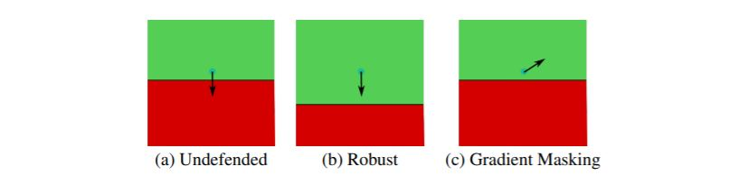
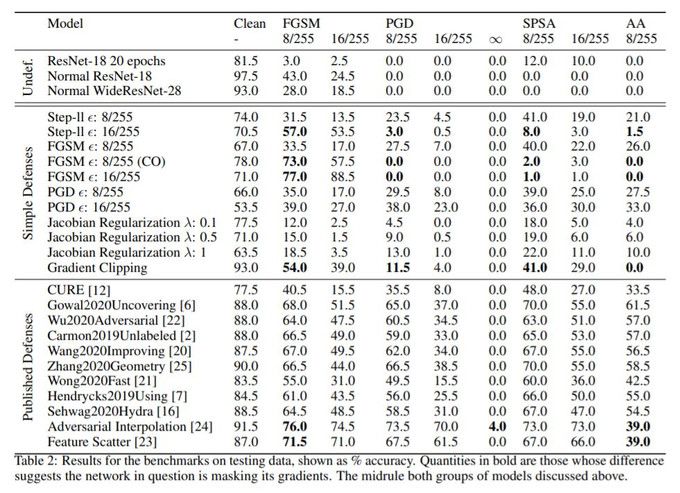
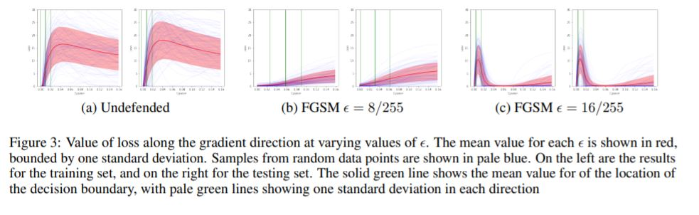
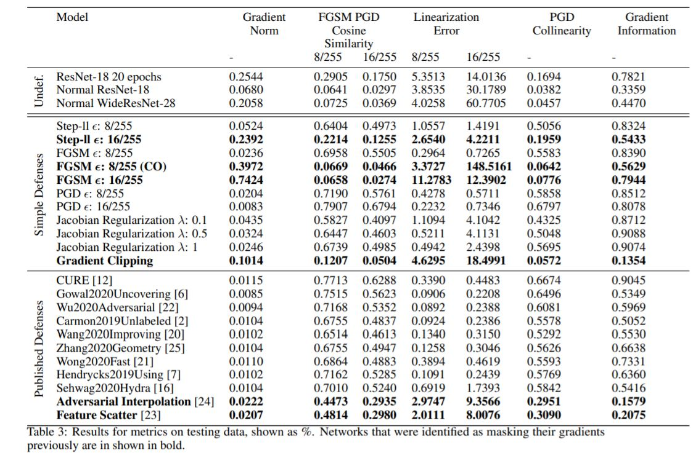
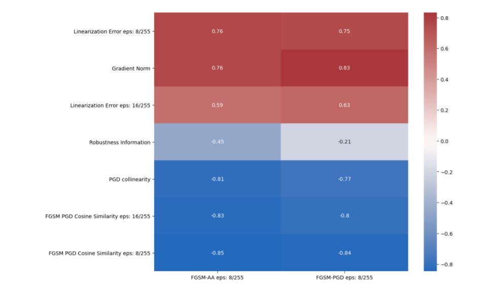

# False Sense of Security

Recently, several papers have demonstrated how widespread gradient masking is amongst proposed adversarial defenses. Defenses that rely on this phenomenon are considered failed, and can easily be broken. Despite this, there has been little investigation into ways of measuring the phenomenon of gradient masking and enabling comparisons of its extent amongst different networks. In this work, we investigate gradient masking under the lens of its mensurability, departing from the idea that it is a binary phenomenon. We propose and motivate several metrics for it, performing extensive empirical tests on defenses suspected of exhibiting different degrees of gradient masking. These are computationally cheaper than strong attacks, enable comparisons between models, and do not require the large time investment of tailor-made attacks for specific models. Our results reveal several distinct metrics that are successful in measuring the extent of gradient masking across different networks.

### Benchmarks

In order to interpret the metrics we will propose, we need to understand which of these defenses exhibit gradient masking. To do this, we make use of the behaviours described in the introduction as a checklist.

These results prompted a further investigation through visualization, where we plot the values of the loss as the direction of the gradient is followed from a data point. This is done for several data points, for which the mean and standard deviation are shown.

### Results

The results from the devised metrics as well as their correlation to indicators of gradient masking can be seen below.

### Running instructions
Run python setup.py develop

Run conda env create --file environment.yml --name $ENV NAME HERE$

Use this environment to run the code.
